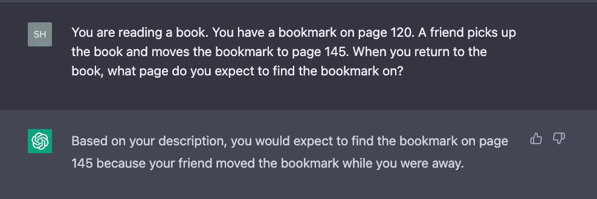

# Goals

+ "Situational Awareness"
+ In light of that, what is AI safety

# Situational Awareness

> By 2025/26, these machines will outpace college graduates. By the end of the
> decade, they will be smarter than you or I [sic]...
>
> Everyone is now talking about AI, but few have the faintest glimmer of what is
> about to hit them. Nvidia analysts still think 2024 might be close to the
> peak. Mainstream pundits are stuck on the willful blindness of "it's just
> predicitng the next word"
>
> Before long, the world will wake up. But right now, there are perhaps a few
> hundred people, most of them in San Francisco and AI labs, that have
> *situational awareness*.... [they] correctly predict[ed] the AI advances of
> the past few years. Whether these people are also right about the next few
> years remains to be seen. But these are very smart people -- the smartest
> people I have ever met -- and they are the ones building the technology.... If
> they are seeing the future even close to correctly, we are in for a wild ride.
>
> *Leopold Aschenbrenner, Former OpenAI researcher, June 2024*

# Thoughts on Situational Awareness

+ I don't think people realize just how big a gap exists in what AI researchers
  at top labs 
+ Only several hundred people is bad, this technology will affect everyone
+ People deserve to know about and form opinions about crazy things that might
  be happening before it smashes into them

# Progress in AI has been extremely rapid

+ 19 months ago ChatGPT was released
    * Hacky product
    * Still fastest product launch ever
    * By today's standards a terrible AI
+ Since then, we have had roughly *three* more generations of LLMs each of which
  blows the previous out of the water
    * GPT-3.5, GPT-4, Claude 3.5, (GPT-5 is currently training and will likely
      finish its training in another few weeks; likely more months)

# Demos

+ The easy failures of ChatGPT have long since been corrected
+ You are reading a book. You have a bookmark on page 120. A friend picks up the book and moves the bookmark to page 145. When you return to the book, what page do you expect to find the bookmark on?
+ 
+ Which is heavier, 10 kg of iron or 10 kg of cotton?
+ 

# Broadly Superhuman AI is coming soon

> These next three years might be the last few years that I work. I am not ill,
> nor am I becoming a stay-at-home mom, nor have I been so financially fortunate
> to be on the brink of voluntary retirement. I stand at the edge of a
> technological development that seems likely, should it arrive, to end
> employment as I know it. 
>
> *Avital Balwit, Chief of Staff to the CEO of Anthropic*

[https://www.palladiummag.com/2024/05/17/my-last-five-years-of-work/](https://www.palladiummag.com/2024/05/17/my-last-five-years-of-work/)

# We're not on track for it to go well

+ Enormous misbalance in resources allocated to safety vs capabilities
+ U.S. AISI expected to be funded according to Schumer et al. up to 10 million
  dollars
    * Salary of only a few researchers at top AI labs
+ Even "charge ahead and build" people are worried
    * "We're not guaranteed to make it"
+ Game of Russian Roulette

# Need people working in technical AI safety

+ Technical AI safety is a large field with many diverse subfields

# Mechanistic Interpretability 

+ Opening up the black box and seeing the brains!

# Evaluations

+ What does it even mean for something to be "safe;" what benchmarks are there?

# Scalable Oversight

+ Debate
+ Bootstrapping oversight
    * Automated alignment research
    * Labs are currently explicitly trying not just to hire AI alignment researchers, but
      to *create* AI alignment researchers

# AI Theory

+ Singular Learning Theory
+ Agent foundations

# Need people working in safety governance

+ Even "common-sense" bills are hard to pass
+ Currently diffficult to pass a bill banning AI systems from controlling nukes

# Pausing AI

+ We need more time to make research happen
+ Coordination is hard but not impossible! (think potable water)

# Effectiveness of coordination

+ Drinking water out of our taps

# If you're interested what can you do?

+ Jump into technical research!
+ Need people to know about this and talk about it!

